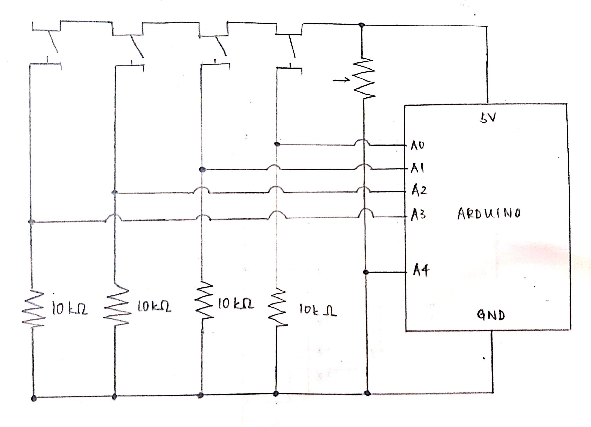
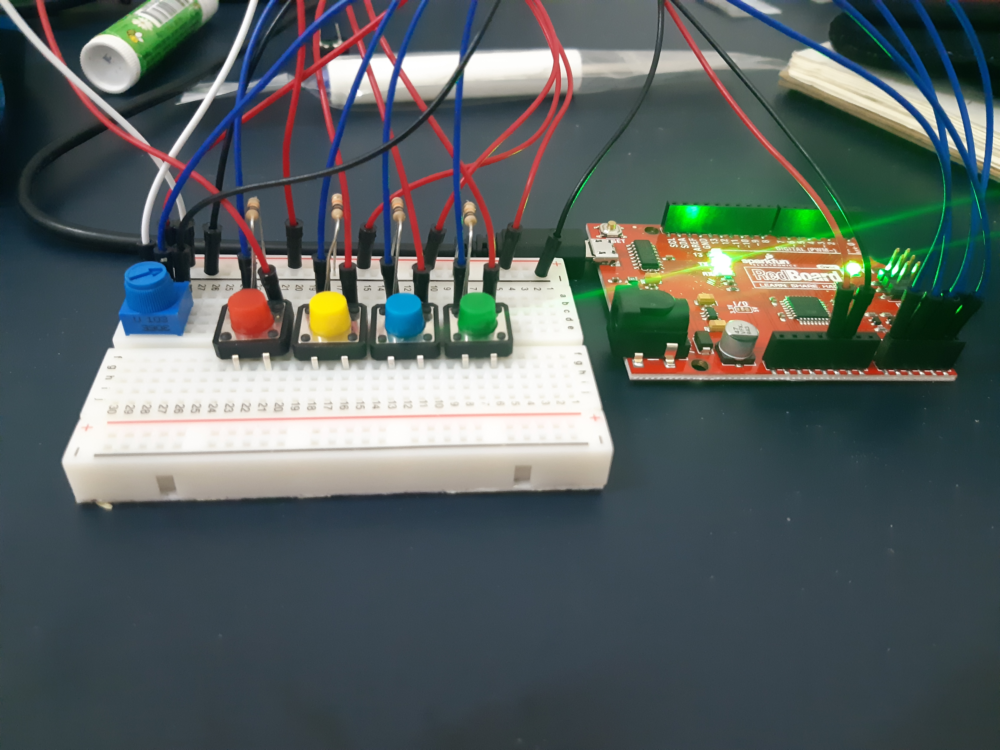
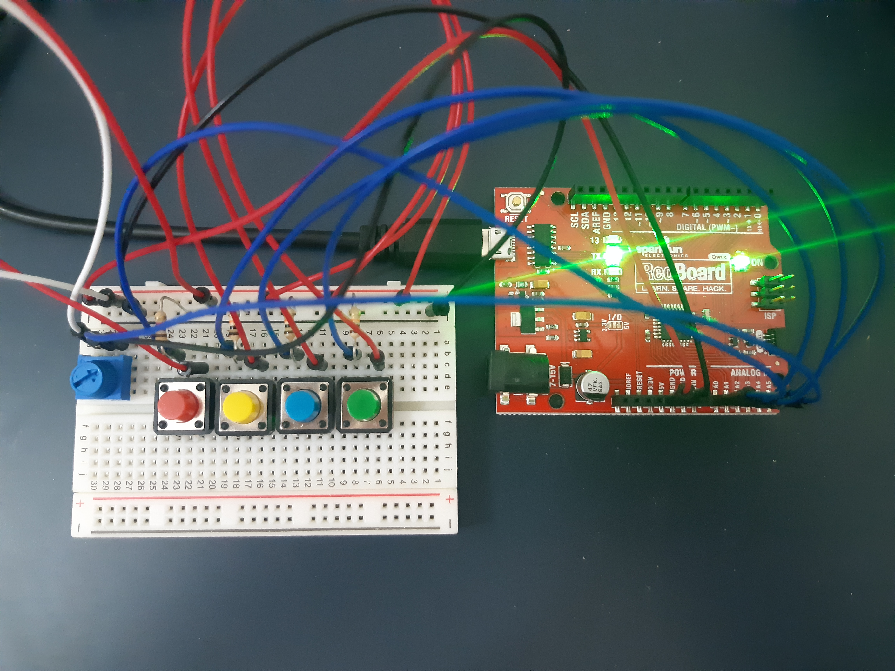
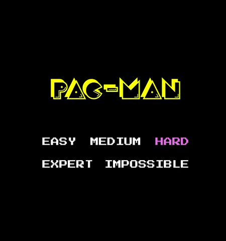
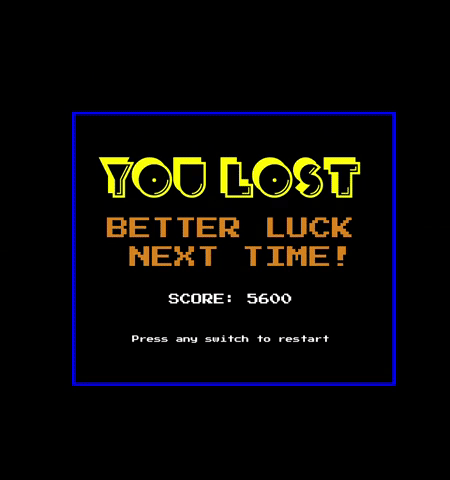
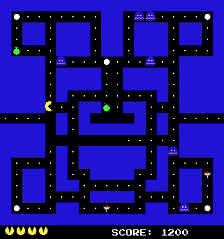
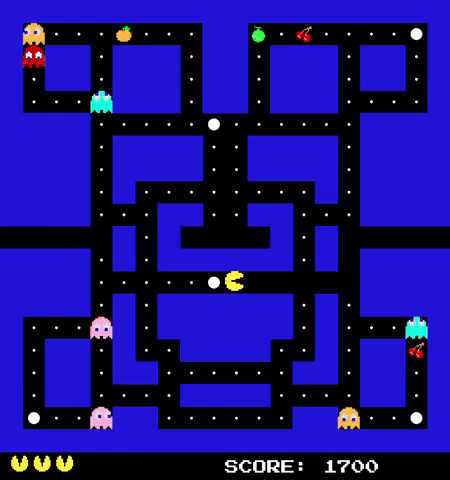

# Final Project: Pac-Man

## Concept

My version of the famous arcade game Pac-Man. The player's aim is to eat all the food pellets while avoiding the ghosts. The player starts the game with four lives. Each collision with a ghost reduces the player's lives by one, and the Pac-Man sprite respawns near the center of the screen. Each food pellet consumed gives the player a score increment of 100. Powerups, represented by large circles, make ghosts vulnerable to Pac-Man for 5 seconds (and make Pac-Man invulnerable to the ghosts, allowing Pac-Man to "eat" the ghosts.) Each ghost "eaten" by Pac-Man gives a score increment of 400, and each special fruit pellet (represented by fruit images) consumed gives a score increment of 400 as well. Pac-Man and the ghosts cannot travel through "walls", represented by solid blue squares. Pac-Man can, however, exit the screen on the left and return from the right through a specific "portal".

## Added Features

For my final project, I decided to build on the Pac-Man game I had created for my midterm. Features that I added include:
- Communication between Processing and Arduino, allowing users to control Pac-Man's movements through Arduino inputs
- A starting screen, allowing users to choose between five levels of difficulty
- An ending screen, allowing users to restart the game easily
- Walls that neither Pac-Man not the ghosts can pass through
- A portal that Pac-Man can "disappear" off, "reappearing" on the other end of the screen
- Powerups, allowing Pac-Man to "eat" ghosts
- Fruits, giving higher scores than regular food pellets when eaten

## Arduino Schematic and Circuit

Since the Arduino component of my project was fairly simple, only taking five inputs, the schematic turned out to be rather simple as well. Pictures of the circuit are attached below.

      

## Results

Attached below are GIFs of several features. Other features of gameplay, such as the fruits or walls, are also observable.

The starting and ending screens:

  

Pac-Man entering and then exiting the portal: 

And Pac-Man consuming a powerup:

## Challenges

I faced challenges in creating the walls, since pixel-based checks tend not to work all the time. To overcome this, I had to refactor most of my game to work on a grid instead. I drew inspiration from a version of Pac-Man created by Jay McDaniel (in p5.js), especially when it came to checks that prevented characters from moving through walls and in their use of a blueprint system for constructing the walls (as seen in board.pde).

I initially wanted to allow the user to alter the characters' speeds in real-time using a potentiometer. However, after refactoring most of my game to work on a grid-based rather than pixel-based system, any alterations to Pac-Man's absolute velocity broke most of my checks. The frameRate, which I had been using to alter the sprites' speeds (for debugging), is always initialized in setup(), and my attempts to change it in draw() failed. To overcome this challenge, I chose instead to allow users to select difficulty levels using the potentiometer. It is not quite what I envisioned, but I am happy with it nonetheless.

## References

[Jay McDaniel's Pac-Man](https://github.com/JayMcDaniel/pacman/blob/master/localhost/pacman/pacman.js)
