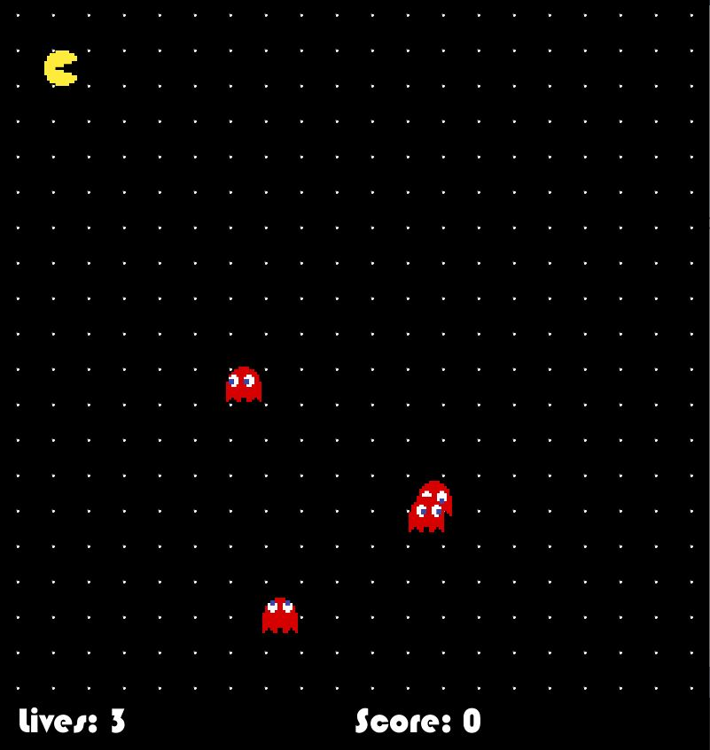
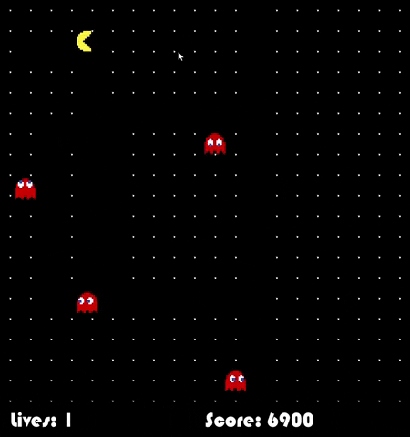
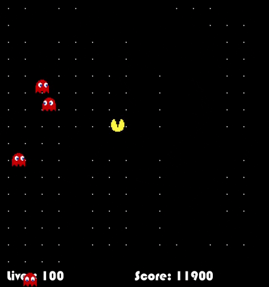
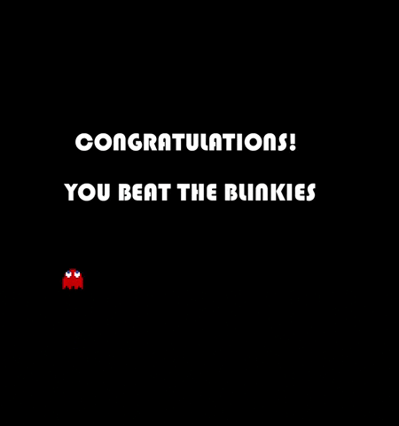
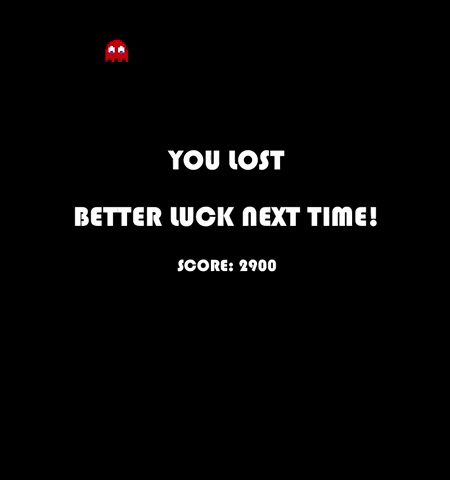

# Midterm Project Documentation

## Pac-Man

### Description

For my midterm project, I decided to create a simplified version of the arcade game Pac-Man. 

My version has no walls that block passage, and so both Pac-Man and the ghosts can roam freely. The player wins by "consuming" all the food pellets, and loses lives by running into the ghosts. Each food pellet "consumed" gives a score increment of 100 points, and both the number of lives left and the score are displayed in a hub at the bottom of the screen. The player controls Pac-Man with their arrow keys. Pac-Man starts the game in the top left corner of the screen, while the ghosts are instatiated with random locations.

Both Pac-Man and the ghosts bounce off the edge of the screen when they hit it, and the ghosts change direction at random 5% of the time. The sprites are programmed such that only the x- or y-velocity can have a non-zero value at any time, which ensures they do not move in diagonals.

I was able to "animate" Pac-Man's movement by loading in different images based on the frameCount at any given time. Since the image loaded also had to change with Pac-Man's direction, this involved loading quite a few images — 12 in total. The ghosts' images also change based on their directions, while the food pellets are created using the primitive circle() shape.

At the end of the game (when the player has either eaten all the food or lost all their lives), one of two screens shows up: 

The ghost left on-screen is a deliberate feature to add movement and interest to the ending screens.

### Challenges and Potential Improvements

The sound library could not process the .mp3 file I uploaded. This turned out to be a fairly easy fix however, since I was able to use another library, minim, to load the soundtrack I wanted.

I also occasionally faced a scenario where one of my sprites would simply hit the edge of the frame and get stuck there, not bouncing back like they were programmed to. I am still unclear as to what might be causing this, though I can create it by changing directions when Pac-Man hits the edge of the screen. 

Another aspect of the program that I would like to fix is the fact that the ghosts occasionally instantiate very near Pac-Man, and "collide" with Pac-Man by bouncing off the walls right next to it, leaving the player to start the game with only a single life. I might consider making Pac-Man "immune" in its starting position, to prevent this from happening in the future.
