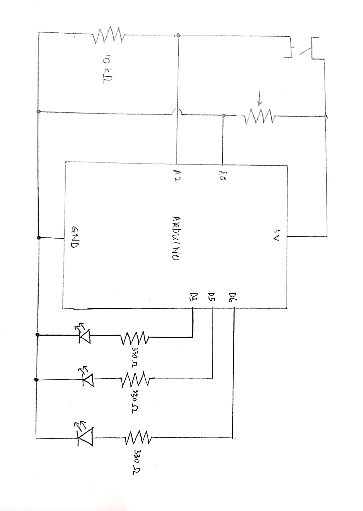

# Traffic Light LEDs

### Concept

This project uses three LEDs to simulate a traffic light, with the green light on by default, turning yellow and then red when a specific input is provided.

A momentary switch and potentiometer are used as sensors in this circuit, while three LEDs (red, yellow, green), are used as actuators. The red LED is connected to port 3, the yellow to port 5, and the green to port 6. When the switch is not pressed, only the green LED lights up. When the switch is pressed, only the yellow LED lights up for some time, after which only the red LED lights up. The input from the potentiometer is used to determine how long the yellow LED lights up for, before the red LED lights up.

The schematic of my project is attached below:

As are a couple of photos:

   

### Challenges 

I spent quite a bit of time trying to figure out why my switch was consistently giving an output of HIGH even when not pressed, and with the connecting jumper wires at opposite corners. After some googling, I found out that I had not connected a resistor between the switch and GND, and so there was no potential divider.  
