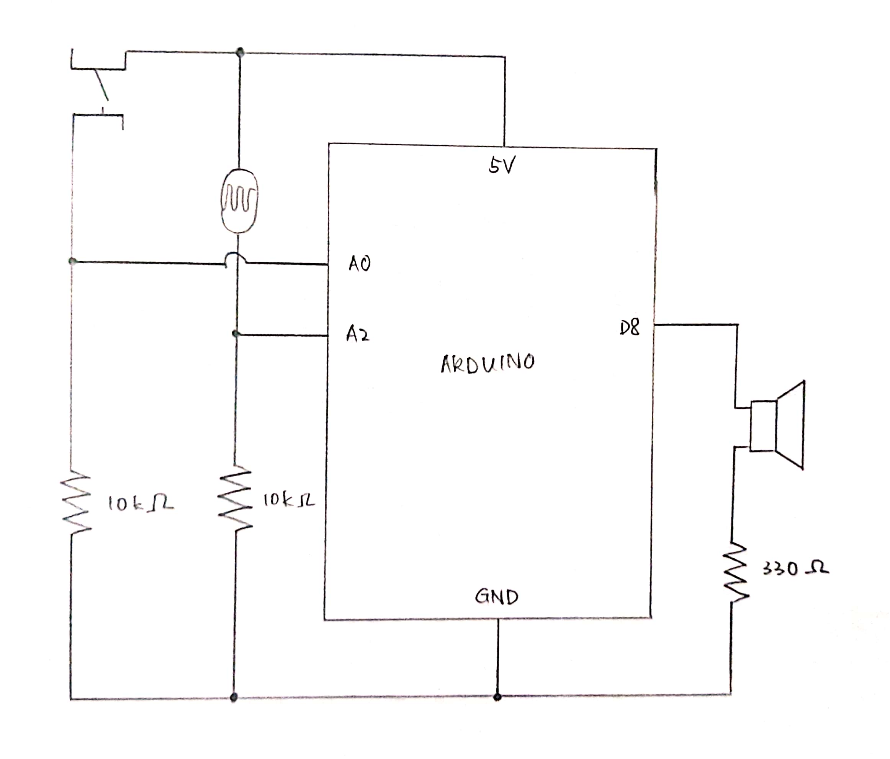

# Modified Theremin

### Concept

I created a modified theremin for this project, using a photoresistor and momentary switch as sensors and a speaker as an actuator. Much like a typical theremin, the player creates higher pitches by moving their hand closer to the photoresistor (and thus blocking out more light), and lower pitches by moving away. In order to create sound, however, the player must also constantly hold down the momentary switch. This helps in giving a clear start and end to the music, and also kept me sane in the testing process.

### Schematic

### Results

Attached below are photos of my completed project, as well as a link to a video of what I have convinced myself sounds like "Mary had a Little Lamb" played on my theremin.

### Challenges

I seem to always be missing a resistor somehow. For this project, something that helped me identify my mistake was actually removing nearly all of the components on my breadboard and starting over.
