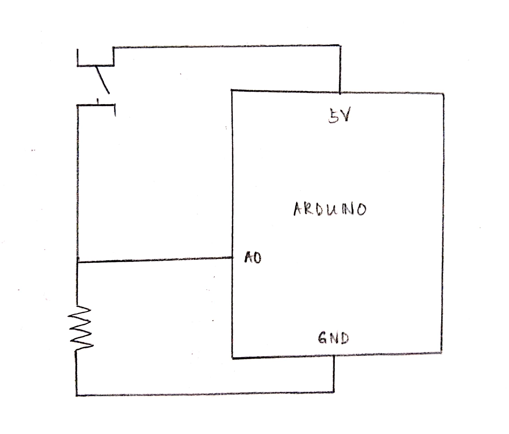

# Communication Project

# Concept

Drawing inspiration from Dan Shiffman's tutorial on the Chrome Dinosaur Game, I decided to create my own version featuring Pac-Man as the dinosaur and Blinky as the cacti. Pac-Man jumps over the Blinkies to survive, and scores points for living longer. I used a simple momentary switch as the input for this game: when the switch is pressed (giving an input of 1), Pac-Man jumps. 

[https://www.youtube.com/watch?v=l0HoJHc-63Q&t=826s](Dan Shiffman's Tutorial)

# Schematic 

# Results

# Challenges

Something about the communication with Arduino seems to be making my Processing software run quite slowly — sometimes, even when the switch input prints as 1, Pac-Man does not jump until several seconds later (and is sometimes completely unresponsive). Curiously, resetting the Arduino and re-running the Processing program seems to solve this problem temporarily. 
