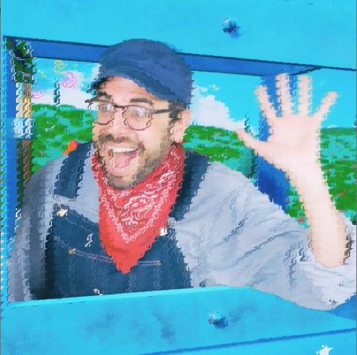
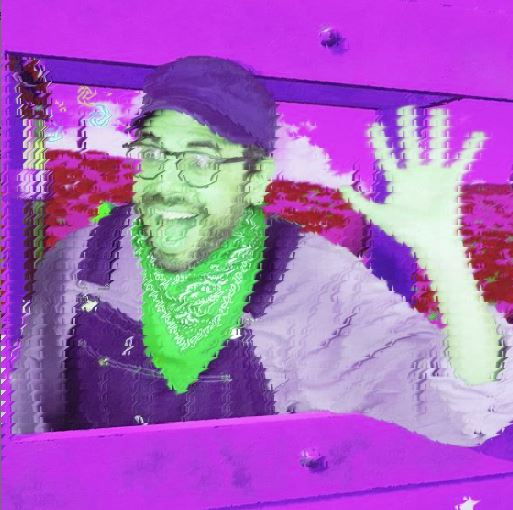
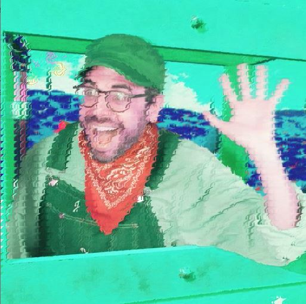

# Image Manipulation Project

For this project, I drew inspiration from the "pointillist-like" effect that Daniel Shiffman explores in the Processing tutorial on images and pixels. I wanted to create a "pixelated" effect on a given image, and planned to do so by dividing my image into groups of pixels, selecting a "center" pixel for each group, and altering the color of all other pixels in the group to match the "center". 

[Daniel Shiffman's Tutorial](https://processing.org/tutorials/pixels/)

I chose to make my pixel "groups" 11x11 squares, selecting the 6th pixel from the top and left as the "center". The first image below is unaltered, while the second one has been "pixelated".

By switching around the rgb values of each pixel, I was also able to produce the following images. The color effects were inspired by Andy Warhol's Marilyn Diptych. 

### Challenges

Although I initially intended to "pixelate" my image by creating squares, my program appears to have distorted it in a slightly different way. I suspect this may be due to a misalignment of the color alterations in the x and y axes, though I was not able to figure out what exactly was causing this problem in my code. 
