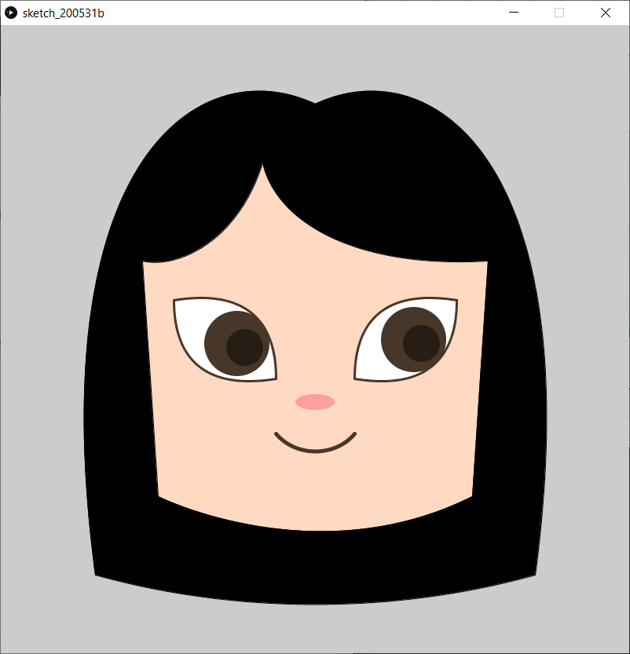

# Self-Portrait Assignment

Going into this assignment, I realized that creating an image of a human face would mostly require using curves, so I played around with arc() for a bit. I found that figuring out the angles was quite time-consuming and didn't allow me to skew the curve a certain way, so I did a quick search for custom shapes in Processing. I found two very helpful resources - Dan Shiffman's video on custom shapes, where he also references a book chapter from Programming Design Systems by Rune Madsen.

[YouTube video on custom shapes](https://www.youtube.com/watch?v=76fiD5DvzeQ)

[Programming Design Systems book chapter](https://programmingdesignsystems.com/shape/custom-shapes/index.html#custom-shapes-pANLh0l)

Even though both these resources are geared towards p5.js rather than Processing as we use it, I found that all the functions I needed were transferable, and ended up liberally using beginShape(), endShape(), and bezierVertex(). A screenshot of the final self-portrait is attached below!

