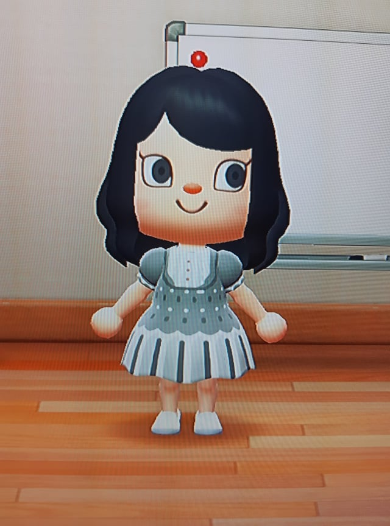
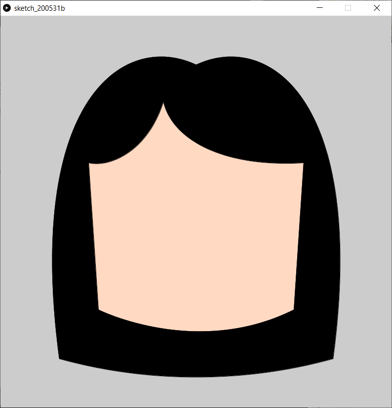
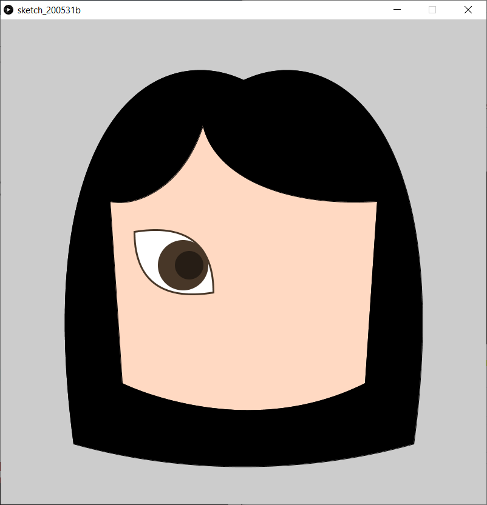
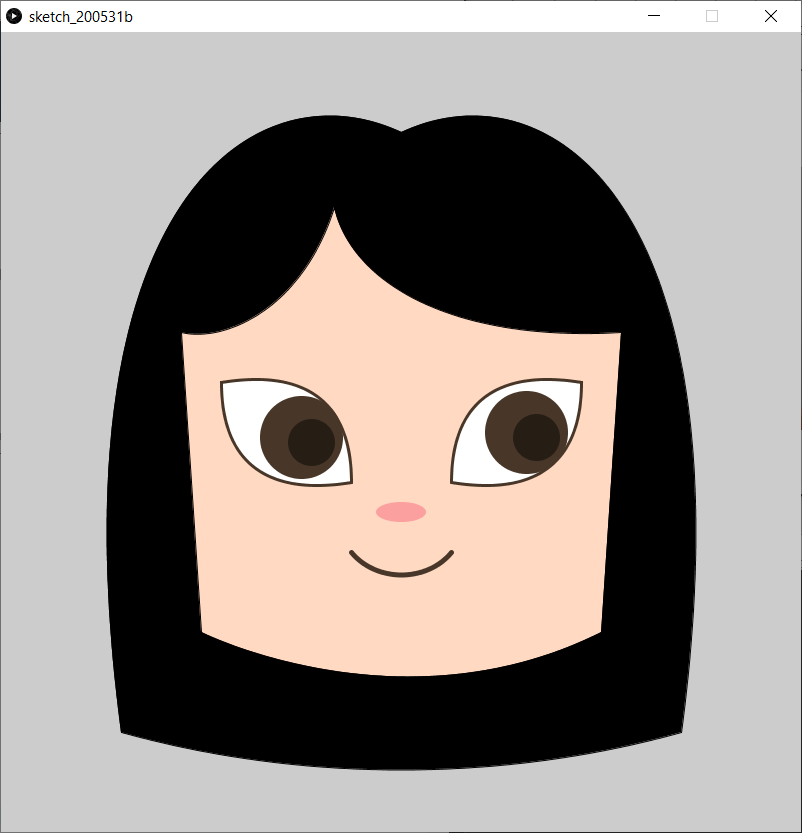

# Self-Portrait Assignment

Going into this assignment, I was well aware that I'm not the best at translating real life objects to paper (or code). I wanted to focus on playing around with Processing (rather than spend time being reminded I cannot draw) so I decided to use an avatar from a video game I play as a reference. 

I realized that creating this image would mostly require using curves, so I played around with arc() for a bit. I found that figuring out the angles was quite time-consuming and didn't allow me to skew the curve a certain way, so I did a quick search for custom shapes in Processing. I found two very helpful resources - Dan Shiffman's video on custom shapes, where he also references a book chapter from Programming Design Systems by Rune Madsen.

[YouTube video on custom shapes](https://www.youtube.com/watch?v=76fiD5DvzeQ)
[Programming Design Systems book chapter](https://programmingdesignsystems.com/shape/custom-shapes/index.html#custom-shapes-pANLh0l)

Even though both these resources are geared towards p5.js rather than Processing as we use it, I found that all the functions I needed were transferable, and ended up liberally using beginShape(), endShape(), and bezierVertex().

I began by trying to figure out a basic face shape for the portrait, using the three functions mentioned above. This is the result:

![]{progress1.png)

After getting that down, I moved to drawing the shape of the hair. I later moved the chunk of code drawing the hair above the one drawing the face (order matters!) and added colors for both.

Following this, I began drawing the left eye - which turned out to be easier than I expected! After tweaking some function parameters I was mostly done. I edited the stroke weight of the eye so it would look less harsh and also more closely resemble the reference. 

Once that was done, the right eye was quick to finish (since nearly all the y-values were the same as for the left eye). I edited the location of both pupils slightly to make them look more natural.

To finish off, I drew the nose and mouth of the portrait using the ellipse() and bezier() functions. 

