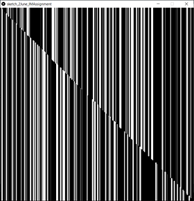
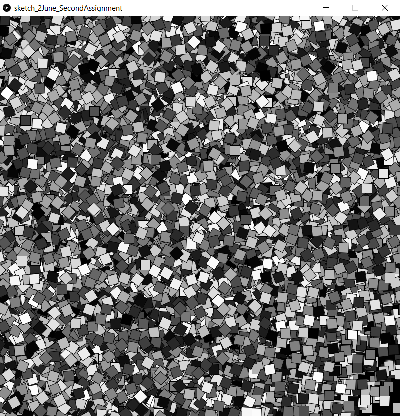

# Work of Art Assignment

This task reminded of some work in generative art I had seen before, and so I wanted to introduce elements of randomness into my project.
I used the random() function liberally, to determine the thicknesses of each line as well as the end point of the drawing. 

I also experimented with a second project, which randomly rotated squares and filled them with different colors.

