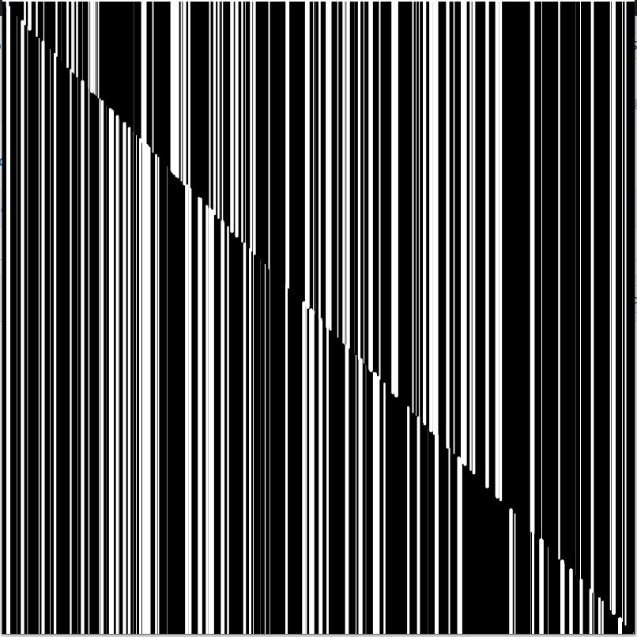

# Work of Art Assignment

This task reminded of some work in generative art I had seen before, and so I wanted to introduce elements of randomness into my project. I used the random() function liberally, to determine the thicknesses of each line as well as the end point of the drawing. This artwork uses a while() loop to control the end point of the drawing. 

I also experimented with a second project, which randomly rotated squares drawn on top of one another and filled them with different colors. This artwork uses a nested for() loop to generate and draw the squares.

### Challenges

Since randomness was a major feature in this project, one challenge I encountered was balancing the randomness of the program with the outcome I wanted to generate. Since this is something we explore in a later class as well, I'm excited to see how this can translate beyond the computer screen!

Additionally, I found it challenging to scale the complexity of the artwork - most of the ideas I could come up with were either very simple and could be completed in a few lines of code, or seemed very complex and would have required more time to complete. While I wasn't able to resolve this, I do look forward to creating more complex projects later on.
