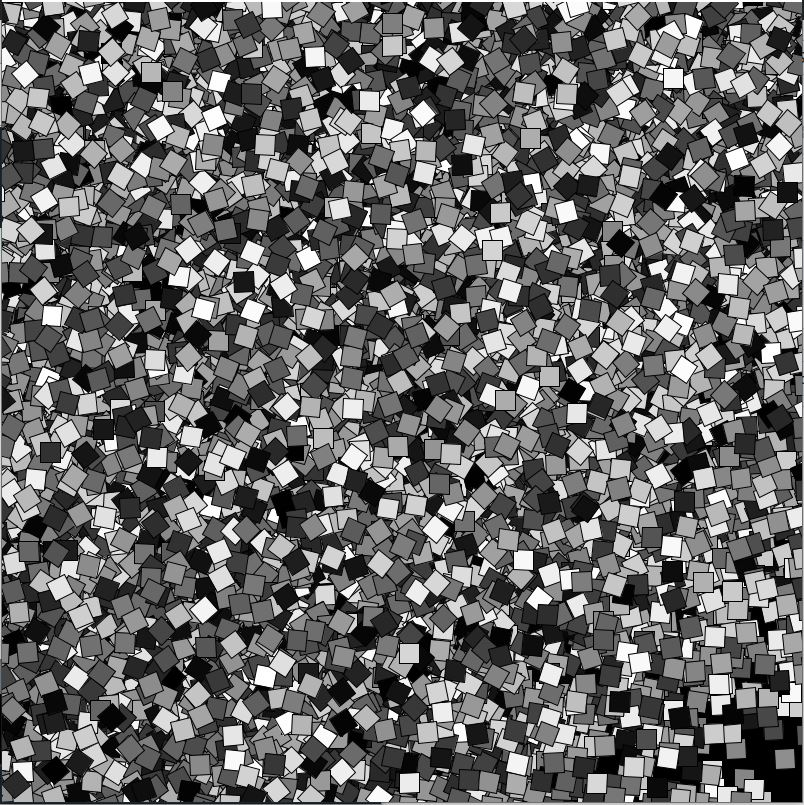

# Work of Art Assignment

This task reminded of some work in generative art I had seen before, and so I wanted to introduce elements of randomness into my project.
I used the random() function liberally, to determine the thicknesses of each line as well as the end point of the drawing. 

I also experimented with a second project, which randomly rotated squares drawn on top of one another and filled them with different colors.

##### Challenges

Since randomness was a major feature in this project, one challenge I encountered was balancing the randomness of the program with the outcome I wanted to generate. Since this is something we explore in a later class as well, I'm excited to see how this can translate beyond the computer screen!
