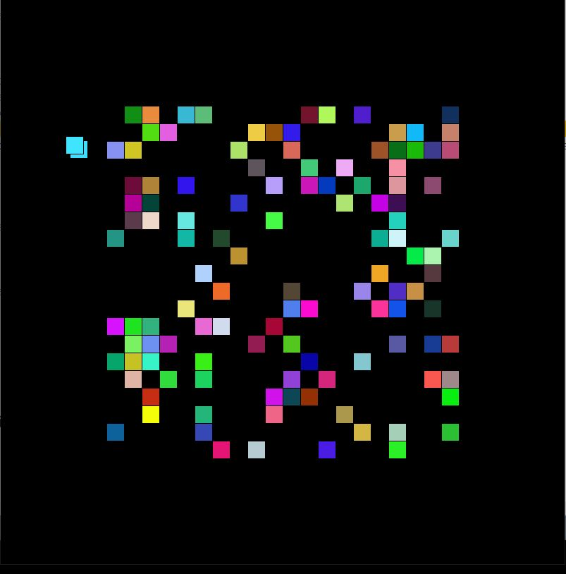

# OOP Artwork/Game Assignment

For this assignment, I decided to create a mosaic of multicoloured squares that would "run" off the window one by one, with the artwork terminating where all squares are gone and only the black background is left.

I began with a slightly modified version of the ball exercise we have been doing in class, creating a mosaic of circles and 
simply not wiping the screen after each draw() iteration. The results were quite interesting.

Eventually, I was able to achieve the results I wanted. The screenshot below was taken halfway through the program's execution.

### Challenges and Observations

I noticed that when I set my if condition to (x <= 0) to test whether or not my squares had gone offscreen, those that hit the top or left edge of the canvas ended up staying there rather than moving further. 
I was able to resolve this quite easily by changing the condition to (x <= -25), since my squares all had side lengths of 25 pixels, but I couldn't find anything online about why this was happening and am curious to learn more.

It also took me some time to figure out and debug the section of code making one square take off only after another one had left the screen. Order really does matter!
