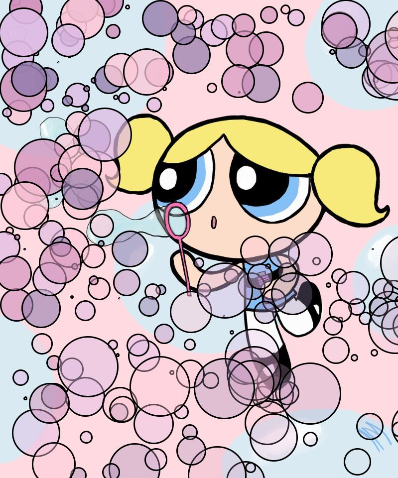
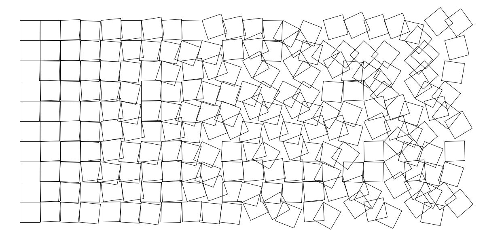
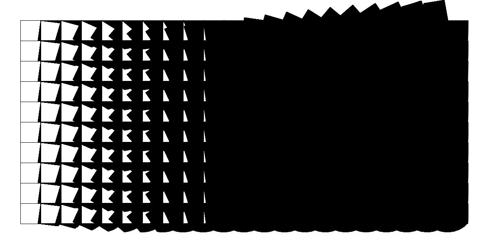

# Data Visualization Project

A "bubble plot" from randomly generated data laid over an image of Bubbles, the Powerpuff Girl, to create a static artwork. (For clarity, "bubbles" hereon refers to the circles of the bubble plot, while "the character" refers to the cartoon character.) The data input was 250 sets of 3 integers per set. 

![]

The bubbles' x and y positions determined by the first and second integers in each set, and the radius determined by the third integer divided by 10. The opacity of each bubble is a function of the width and height, meaning that the bubbles are the most opaque in the top left corner and most transparent in the bottom right.

# Artwork with Transformations Project

For this project, I drew inspiration from George Nees' Schotter:

My version is a grid of squares with the rotation factor increasing as you go from left to right across the x-axis, creating a visual effect of something orderly gradually descending into chaos. The rotation factor of each square is generated randomly (but with increasing bounds at higher x-position values). Both the translate() and rotate() transformations are used in this artwork to draw each square. Using a nested for() loop in the setup() function, I was able to do this without any hard-coding and create a static artwork.

I also experimented with dynamic versions of my artwork, drawing the squares in the draw() function rather than the setup(). This yielded some interesting results as well:

### Challenges 

Something I found quite frustrating while completing the data visualization project was Processing's lack of functionality in terms of data cleaning and preprocessing. I had initially conceptualized a more technical and "statistics-y" project, but found myself unable to carry it out because of the absence of functions like max() and Processing's limited functionality for dealing with empty data values and differing data types. 
